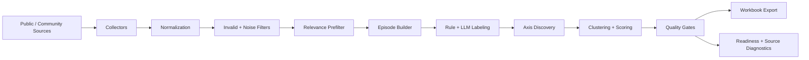

# LOGUE Persona Pipeline

> Evidence-first persona discovery from noisy public community data.


LOGUE Persona Pipeline turns messy community discussions into auditable persona evidence. It collects, filters, labels, clusters, scores, and exports user pain signals into a reviewable persona workbook with source-balance checks, weak-source diagnostics, and explicit readiness tiers.

This is not another LLM summarizer. It is a research pipeline designed to show what you can claim, what you should review, and what you should not overstate.

**Current release status**

- `reviewable claim release`
- not a full deck-ready corpus
- not a production-ready persona system as a whole
- `3` final-usable, production-ready personas
- `1` review-ready, deck-ready-claim-eligible persona under constraint
- adjusted denominator coverage passes as an audited secondary metric
- source balance and weak-source debt still block full deck-ready status

## Why This Matters

LLMs can generate convincing personas from weak evidence.

Community data is noisy, biased, duplicated, support-heavy, and structurally inconsistent. A Stack Overflow debugging thread, a Reddit complaint, a GitHub discussion, and a vendor community post do not carry the same evidentiary weight, even if they talk about similar pain.

Good persona research is not about generating attractive narratives. It is about knowing:

- what evidence supports each claim
- which sources shaped the result
- where the system should stop before overclaiming

This repository focuses on auditability, source diagnostics, quality gates, and claim boundaries rather than polished output alone.

## What The Pipeline Does

The pipeline converts public/community data into a reviewable workbook through explicit, rerunnable stages:

1. collect public/community data
2. normalize heterogeneous sources
3. filter invalid and noisy rows
4. prefilter for relevance
5. build user-pain episodes
6. label episodes with rule-based and optional LLM-assisted workflows
7. discover persona axes
8. cluster and score persona candidates
9. audit source balance, weak-source debt, denominator eligibility, and readiness
10. export workbook artifacts for review

The point is not just to find patterns. The point is to preserve enough structure that an analyst can inspect where those patterns came from.

## Pipeline Architecture



Canonical stage order:

```bash
python run/pipeline/00_generate_time_slices.py
python run/pipeline/01_collect_all.py
python run/pipeline/01_5_expand_queries_from_raw.py
python run/pipeline/02_normalize_all.py
python run/pipeline/02.5_filter_time_window.py
python run/pipeline/03_filter_valid.py
python run/pipeline/03_5_prefilter_relevance.py
python run/pipeline/04_build_episodes.py
python run/pipeline/05_label_episodes.py
python run/pipeline/06_1_discover_persona_axes.py
python run/pipeline/06_cluster_and_score.py
python run/pipeline/07_export_xlsx.py
```

This repository is intentionally:

- local-only
- file-based
- rerunnable stage by stage
- auditable at every major handoff

It is intentionally not:

- a simple scraper
- a black-box LLM summarizer
- a generic dashboard
- a finished SaaS product

## Why It Feels Different

Most persona-generation demos stop at "collect text, prompt a model, export a summary."

This one adds the infrastructure that serious research work actually needs:

- source-aware evidence weighting
- weak-source debt diagnostics
- denominator eligibility diagnostics
- explicit readiness tiers
- claim eligibility separate from workbook readiness
- preserved raw-to-analysis stage boundaries
- workbook-facing validation instead of narrative-only output

In practice, that means the pipeline can say:

- "this claim is supported"
- "this cluster is interesting but constrained"
- "this source is visible but weak"
- "this workbook should stop at reviewable, not deck-ready"

That honesty is part of the product of the repo.

## Current Release Snapshot

The accepted release is intentionally frozen as `reviewable_but_not_deck_ready`.

Headline numbers:

- `final_usable_persona_count = 3`
- `production_ready_persona_count = 3`
- `review_ready_persona_count = 1`
- `deck_ready_claim_eligible_persona_count = 4`
- original coverage: `74.5`
- adjusted conservative denominator coverage: `83.25`
- official effective source balance: `5.89`
- official weak-source cost centers: `4`

Interpretation:

- `persona_01`, `persona_02`, `persona_03` are production-ready and final usable
- `persona_04` is review-ready and deck-ready-claim-eligible under constraint, but not final usable
- `persona_05` is preserved as a future subtheme candidate / blocked candidate
- `persona_06+` tail clusters are diagnostics-only

Why the workbook is still not full deck-ready:

- adjusted denominator coverage clears the coverage gate only as an audited secondary metric
- source balance improves only narrowly under diagnostics
- weak-source debt remains unresolved enough to block a full deck-ready claim
- refined Google / Adobe slice diagnostics improve interpretability, but not enough to justify a stronger readiness promotion

For the final freeze decision, see:

- [docs/operational/FINAL_REVIEWABLE_CLAIM_RELEASE.md](docs/operational/FINAL_REVIEWABLE_CLAIM_RELEASE.md)

## Quality Gates And Claim Boundaries

This project treats claim control as a first-class requirement.

Key gate families include:

- core coverage
- effective source balance
- source concentration
- weak-source debt
- representative example grounding
- workbook-level readiness policy

Important distinction:

- the workbook can contain useful persona evidence
- a persona can be claim-eligible
- a persona can be review-ready
- and the overall workbook can still remain below full deck-ready

That separation is intentional. It prevents "one interesting cluster" from being mistaken for "a finished persona system."

## Key Outputs

Primary outputs under `data/`:

- [data/output/persona_pipeline_output.xlsx](data/output/persona_pipeline_output.xlsx)
- [data/analysis/overview.csv](data/analysis/overview.csv)
- [data/analysis/quality_checks.csv](data/analysis/quality_checks.csv)
- [data/analysis/persona_summary.csv](data/analysis/persona_summary.csv)
- [data/analysis/cluster_stats.csv](data/analysis/cluster_stats.csv)
- [data/analysis/source_balance_audit.csv](data/analysis/source_balance_audit.csv)
- [data/analysis/source_diagnostics.csv](data/analysis/source_diagnostics.csv)

Important diagnostics and release artifacts:

- [artifacts/readiness/](artifacts/readiness/)
- [artifacts/release/](artifacts/release/)
- [docs/operational/FINAL_RELEASE_CHECKLIST.md](docs/operational/FINAL_RELEASE_CHECKLIST.md)

These artifacts matter because they show:

- why a persona was promoted or constrained
- which sources are helping versus distorting
- which rows count as denominator-eligible evidence
- why the workbook stops at reviewable instead of deck-ready

## Quickstart

### Requirements

- Python `3.11`
- local filesystem access
- optional API keys only for enabled source or LLM workflows

Install:

```bash
pip install -r requirements.txt
```

Example environment setup in PowerShell:

```powershell
$env:REDDIT_USER_AGENT="persona-pipeline/0.1 (by /u/your_reddit_username)"
$env:GITHUB_TOKEN=""
$env:ENABLE_LLM_LABELER="false"
```

Optional environment variables depending on enabled workflows:

- `REDDIT_USER_AGENT`
- `STACKEXCHANGE_KEY`
- `GITHUB_TOKEN`
- `OPENAI_API_KEY`
- `LLM_MODEL` or `OPENAI_MODEL`
- `ENABLE_LLM_LABELER`

### Run The Full Pipeline

```bash
python run/pipeline/00_run_all.py
```

### Run The Canonical Stage Sequence

```bash
python run/pipeline/00_generate_time_slices.py
python run/pipeline/01_collect_all.py
python run/pipeline/01_5_expand_queries_from_raw.py
python run/pipeline/02_normalize_all.py
python run/pipeline/02.5_filter_time_window.py
python run/pipeline/03_filter_valid.py
python run/pipeline/03_5_prefilter_relevance.py
python run/pipeline/04_build_episodes.py
python run/pipeline/05_label_episodes.py
python run/pipeline/06_1_discover_persona_axes.py
python run/pipeline/06_cluster_and_score.py
python run/pipeline/07_export_xlsx.py
```

### Common Analysis Loop

```bash
python run/pipeline/03_filter_valid.py
python run/pipeline/03_5_prefilter_relevance.py
python run/pipeline/04_build_episodes.py
python run/pipeline/05_label_episodes.py
python run/pipeline/06_1_discover_persona_axes.py
python run/pipeline/06_cluster_and_score.py
python run/cli/17_analysis_snapshot.py --compare-latest
```

### Workbook And Audit Commands

```bash
python run/pipeline/07_export_xlsx.py
python run/cli/16_persona_workbook_audit.py
python run/cli/17_analysis_snapshot.py --compare-latest
```

Important:

- stages are dependency-sensitive
- downstream stages should be run sequentially, not in parallel
- canonical outputs belong under `data/`
- diagnostics under `artifacts/` are opt-in, not default pipeline output

For stage order and rerun discipline, see:

- [docs/operational/ORCHESTRATION.md](docs/operational/ORCHESTRATION.md)

## Repository Structure

```text
config/          source configs, filters, labeling policy, query maps, time windows
run/pipeline/    main sequential pipeline stages
run/cli/         targeted audit, validation, and operating commands
src/             collectors, normalizers, filters, episodes, labeling, analysis, exporters
tests/           unit and regression tests
docs/            operational docs, contracts, runbooks, and policy notes
artifacts/       opt-in diagnostics, readiness, and release evidence
data/            local raw, parquet intermediates, analysis outputs, final xlsx
```

Storage contract:

- raw input/output: `data/raw/{source}/*.jsonl`
- normalized / valid / episodes / labeled / analysis: parquet
- final export: `data/output/*.xlsx`

## Who This Is For

- product managers
- UX researchers
- data analysts
- research engineers
- startup and product discovery teams
- open-source contributors interested in pipelines, labeling systems, and evidence-aware research tooling

## Contribution Opportunities

If you like this repo, the highest-value contributions are not "make the summary prettier."

They are things like:

- new collectors for relevant public/community sources
- stronger source adapters and normalizers
- source-specific filtering improvements
- better episode segmentation diagnostics
- labeling rule improvements and audit tools
- denominator and claim-boundary evaluation
- source balance and weak-source diagnostics
- regression tests and benchmark fixtures
- workbook validation and export hardening

In other words: contributors who care about evidence quality, not just presentation quality.

## Test And Validation

Useful commands:

```bash
make test-unit
make test-fixture
make test-smoke
make test-full
make validate-config
make validate-schema
```

If `make` is unavailable:

```bash
python run/devtools/test_matrix.py test-unit
python run/devtools/test_matrix.py test-fixture
python run/devtools/test_matrix.py test-smoke
python run/devtools/test_matrix.py test-full
```

Example direct unittest commands:

```bash
python -m unittest tests.test_analysis_snapshot_cli
python -m unittest tests.test_persona_workbook_regressions
python -m unittest tests.test_workbook_export
```

## What This Repo Does Not Claim

- It does not claim that public community data alone automatically yields trustworthy personas.
- It does not claim that LLM-assisted labeling removes the need for diagnostics.
- It does not claim this repository currently produces a fully deck-ready persona corpus.
- It does not claim five production-ready personas.
- It does not claim that every cluster deserves promotion.

The system is most valuable when it stops overclaiming before a team does.

## Why It Might Be Worth Starring

If you care about research engineering, this repo is trying to solve a real and underrated problem:

how to turn noisy public text into persona evidence without pretending the pipeline knows more than it does.

That means:

- explicit pipeline stages instead of opaque notebooks
- auditable artifacts instead of hidden heuristics
- evidence-aware readiness instead of generic "AI insights"
- source diagnostics instead of silent averaging
- honest release boundaries instead of polished overclaiming

## License

License: `TBD`

Until a formal license is chosen, treat this repository as a research-engineering reference implementation and confirm reuse expectations with the maintainer.
